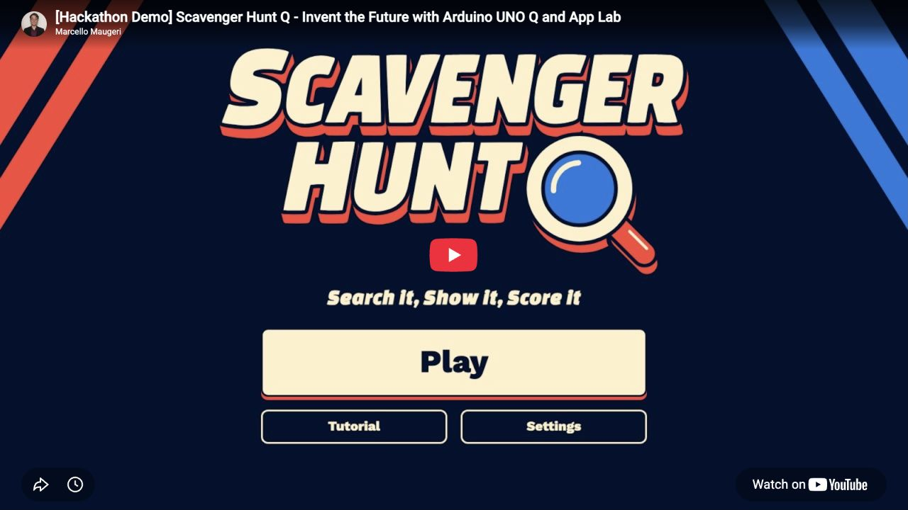
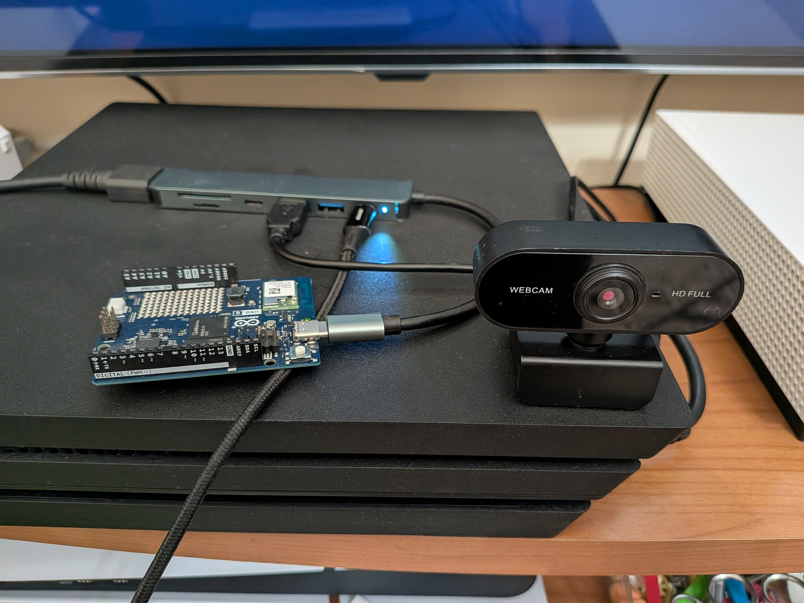
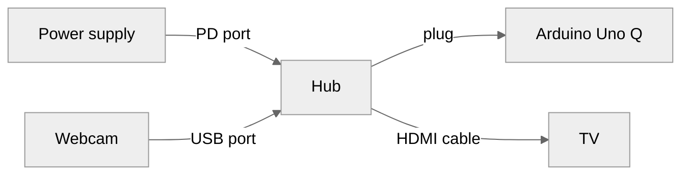
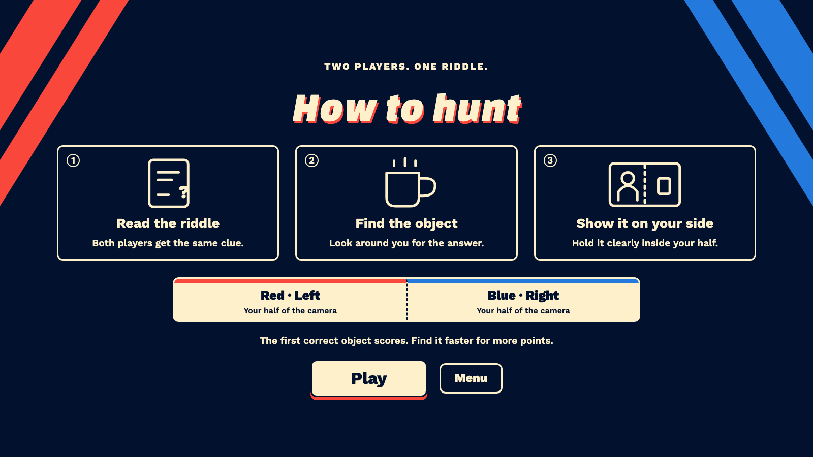
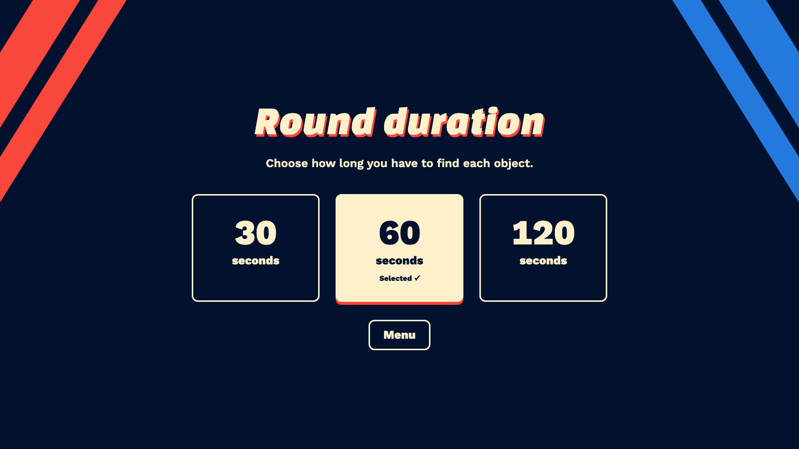
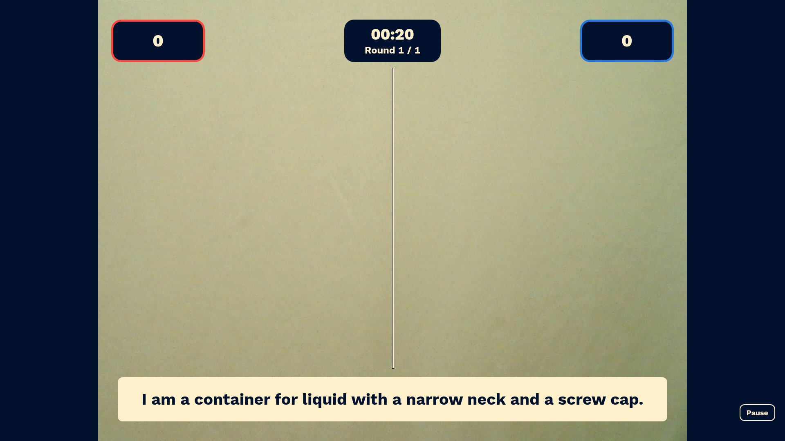
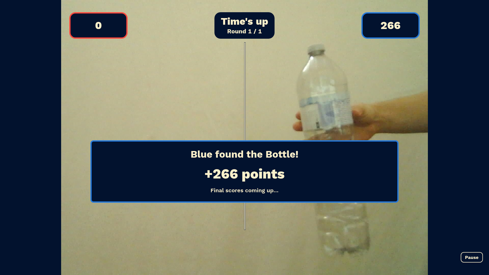
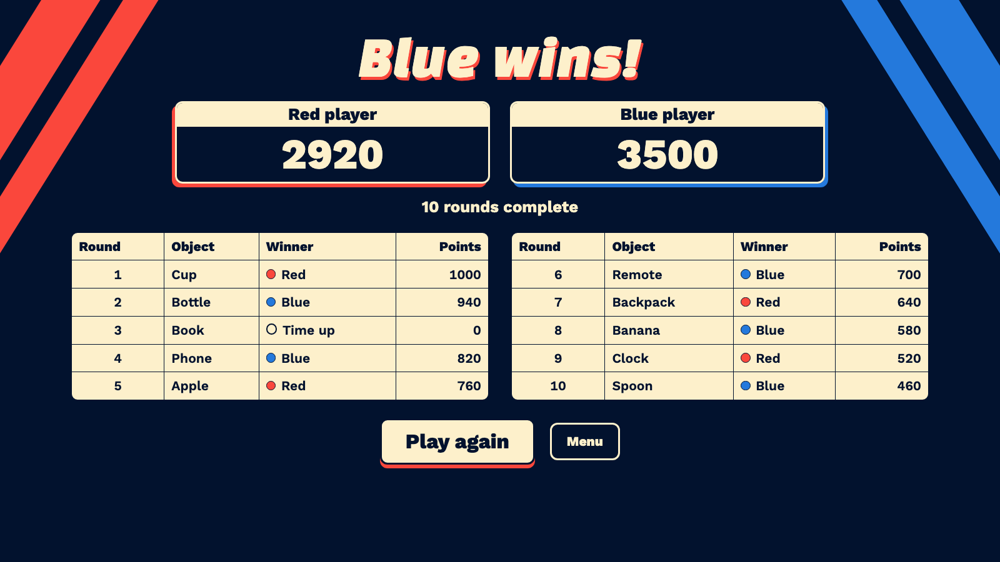

You spend ten minutes looking for the TV remote, then ask mum. She finds it in five seconds, exactly where you already looked. Think you can do better? **Scavenger Hunt Q** turns finding things around the house into a game: solve a riddle, run to find the item and show it to the camera before your rival does. Play one against one or split into teams. The fastest correct answer earns the points, and the highest score after ten rounds wins.

All you need is an **Arduino UNO Q, a powered USB-C hub and a USB webcam with a microphone**, connected to your TV or any HDMI screen. After the one-time installation below, plug everything in and you're ready to play. The board generates fresh riddles, listens for your commands and recognises your answers locally, so you can play without an Internet connection or a separate computer.

## Demo

Want a quick look before playing? Watch the demo to see how to navigate the game with voice commands and how to play. It deliberately shows just one round.

[](https://youtu.be/6EZQcsUjZW4)

## Getting started

### Software dependencies

- Arduino UNO Q Linux image
- Arduino App Lab with Web UI, Object Detection and LLM bricks
- Edge Impulse YOLOX-Nano object detection model
- Qwen 3.5 0.8B Q4_0 language model
- Vosk 0.3.45 with the small English voice model
- Chromium for the TV display

### Hardware dependencies

- Arduino UNO Q (4 GB RAM / 32 GB storage tested)
- USB webcam with microphone: UVC, 1920 × 1080 MJPEG at 30 fps, 16 kHz mono audio
- USB-C hub with **PD power input**, HDMI with audio and a USB webcam port
- Power supply and cable (Apple iPad 10 W charger tested)
- Hub-to-board USB-C connection supporting power, data and video
- HDMI cable and a TV or HDMI screen with speakers



Connect everything as shown, select the screen's HDMI input and position the webcam so both teams fit in a well-lit picture.



### Installation

1. Download **Scavenger-Hunt-Q.zip** and **setup-tv.sh** from the [latest release](https://github.com/marcellomaugeri/Scavenger-Hunt-Q/releases/latest). Complete the board's setup in **Arduino App Lab**, then choose **Create new app ▾ → Import App → Import from computer** and select the ZIP.
2. Check that Object Detection uses **YOLOX-Nano** and LLM uses **Qwen 3.5 0.8B Q4_0**, complete any model downloads and click **Run**. App Lab installs the Python dependencies; the ZIP already contains the Vosk voice model. Enable **Run at Startup** in the app-name menu.
3. To open the game automatically on the TV, run this once on your computer from the folder containing **setup-tv.sh**. Replace `BOARD_IP` with the address shown in App Lab:

```bash
scp setup-tv.sh arduino@BOARD_IP:/tmp/ && ssh -t arduino@BOARD_IP 'sh /tmp/setup-tv.sh'
```

Enter the board password when asked, then restart the board. The script configures automatic desktop login, fullscreen display without a cursor, HDMI audio and game reset with the white button. Adjust the volume on your TV. Internet access is needed for installation and model downloads; gameplay runs offline.

## Walkthrough

The buttons show their voice commands: speak the displayed words, without a wake word. **Play** starts a match, **Tutorial** explains the rules and **Settings** changes the round duration. Red uses the left half of the camera view and Blue uses the right.





After the countdown, solve the riddle, find the item and bring it into view on your side. The coloured outline and label help you see what the camera recognises.



The first accepted answer wins the round, earning more points the sooner it arrives. If time runs out, the answer is revealed and neither team scores.



Rounds advance automatically; **Pause** holds the match, the start command resumes it, and **Menu** leaves it. After ten rounds, the final screen shows the winner, both totals and a recap of each round. A new match draws another selection of objects and generates fresh riddles.



## Technical details

Built for [Invent the Future with Arduino UNO Q and App Lab](https://www.hackster.io/contests/invent-the-future-with-arduino-uno-q-and-app-lab/), the game runs on the UNO Q's Linux system. Arduino App Lab manages the Python app and its model services. The Python game engine handles rounds, timing and scores, while Chromium displays the local web interface over HDMI. The selected bricks and models are declared in [app.yaml](app/app.yaml).

### Models and bricks

| Role | Model and integration | How the game uses it |
| --- | --- | --- |
| Object recognition | **YOLOX-Nano**, packaged through Edge Impulse and served by the `arduino:object_detection` brick | Detects objects and their bounding boxes in the camera image. The game matches their labels against its enabled targets and assigns each detection to the left or right team. |
| Riddle generation | **Qwen 3.5 0.8B Q4_0** through the `arduino:llm` brick and llama.cpp | Writes a riddle from the selected object's facts, using temperature **0.2**. Generated text is checked for incomplete output and answers revealed in the clue. |
| Voice commands | **Vosk 0.3.45** with `vosk-model-small-en-us-0.15`, loaded by the Python app | Listens to the USB microphone continuously and recognises a fixed English command vocabulary. Each word must reach **50% confidence** before the command is accepted. |
| Game interface | `arduino:web_ui` brick | Serves the interface, live camera view and game updates locally on port **7000**. Chromium opens this page on the board itself. |

Riddle generation starts during loading and continues in the menu. A background worker prepares the whole match, requesting the next riddle as soon as the previous one finishes, independently of round progress. Ready clues are reused when their rounds begin. If a clue is still missing, the game waits with the round timer stopped; failed or unsuitable responses are retried. Preparation for the next match begins on the final scores screen. Camera capture, inference and voice input continue while the LLM works.

Object detection processes the latest camera frame in one pass for both teams, without movement tracking. Any detected object class can appear in the guidance, except people. The outline shows one candidate per side, ranked by confidence and box area, but scoring checks **every detected instance of the current answer**. Both require **50% confidence**; the **5% visible-frame area requirement applies only to the outline**, not scoring.

Vosk supplies the game's command vocabulary without training a custom speech model. Arduino's bundled [Hey Arduino keyword model](https://github.com/arduino/app-bricks-py/blob/main/models/models-list.yaml) detects a wake phrase, while the game needs several distinct commands. The [Keyword Spotting brick supports custom Edge Impulse models](https://github.com/arduino/app-bricks-py/blob/main/src/arduino/app_bricks/keyword_spotting/README.md), which would require a trained command model to replace Vosk. The release includes Vosk's model, and App Lab installs its Python package from [requirements.txt](app/python/requirements.txt).

### Enable or disable objects

In App Lab, stop the app and open `python/objects.json` (stored as [app/python/objects.json](app/python/objects.json) in this repository). Change **`enabled` to `false`** for any object you want to exclude, or **`true`** to include it. For example, this existing entry disables the cup:

```json
{
  "label": "cup",
  "name": "Cup",
  "enabled": false,
  "riddle_facts": "small drinking vessel; open top; often a handle; holds tea or coffee"
}
```

The supported labels are listed under `yolox-object-detection` in [Arduino's model catalogue](https://github.com/arduino/app-bricks-py/blob/main/models/models-list.yaml).

### Logs and command-line control

App Lab's app log records recognised voice commands, round results and riddle generation, including failed attempts. The optional [command-line controller](app/python/cli.py) can inspect or control a running game if voice input is unavailable. From this repository on a computer connected to the board's network:

```bash
python3 app/python/cli.py --url http://BOARD_IP:7000 status
python3 app/python/cli.py --url http://BOARD_IP:7000 start
python3 app/python/cli.py --url http://BOARD_IP:7000 log
python3 app/python/cli.py --help
```
